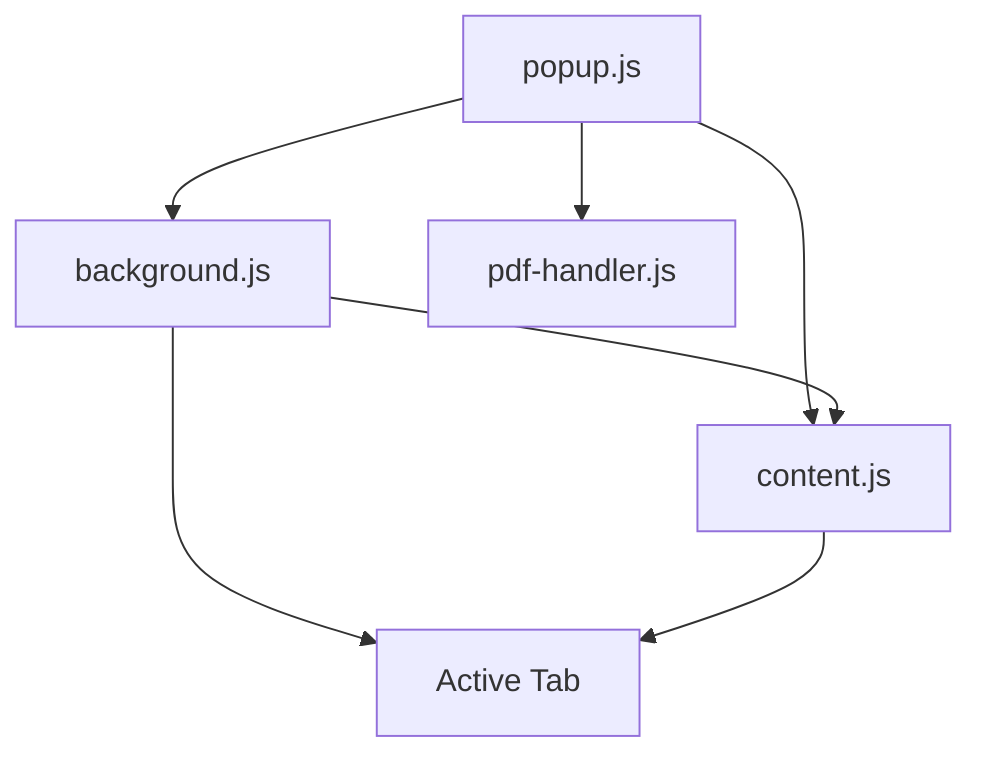

# Firefox Extension Code Annotations

## File Structure and Interactions



## manifest.json
Core extension configuration file:
- `manifest_version: 2` - Using v2 for Firefox compatibility
- `permissions`:
  - `storage` - For secure API key storage
  - `activeTab` - For accessing current page content
  - `tabs` - For tab management and URL detection
  - `scripting` - For content script injection
  - `<all_urls>` - For PDF and webpage access
- `background.scripts` - Uses background.js for persistent content extraction
- `content_scripts` - Injects content.js for page interaction
- `sidebar_action` - Configures the extension to run in Firefox's sidebar
- `web_accessible_resources` - Makes IBM Plex Mono fonts and PDF.js available

## popup.html
Main UI interface:
- Implements a clean, modern dark theme
- Uses IBM Plex Mono for consistent monospace styling
- Key components:
  - Chat message container with auto-scroll
  - Model toggle switch (Local/Deep Research)
  - Settings gear for API key management
  - Input area with send button
  - Copy buttons for message content

## popup.js
Core extension logic:
- Event handlers:
  - `DOMContentLoaded` - Sets up UI and event listeners
  - Model toggle - Switches between Mistral and Deep Research
  - Send button - Handles message sending and response display
- Key functions:
  - `sendPageAwarePrompt()` - Smart content extraction and PDF detection
    - Handles both webpage and PDF content
    - Different behavior for Mistral vs Deep Research
    - Character limits: 40k for Mistral, 50k for Deep Research
  - `sendPrompt()` - Handles API communication with both models
  - `addMessage()` - Manages chat UI updates with copy functionality
- Modal UI for secure API key management

## background.js
Background script for content access:
- Helper functions:
  - `executeScriptInTab()` - Safe script execution in tabs
  - `getActiveTab()` - Reliable active tab detection
- Message handler for content extraction:
  - PDF detection
  - Selected text prioritization
  - Full page content extraction
  - Error handling and timeouts
- Returns standardized response format:
  ```javascript
  {
    success: boolean,
    text: string,
    isPDF: boolean,
    error?: string
  }
  ```

## content.js
Content script injected into pages:
- Handles direct page interaction
- Extracts text content:
  1. Selected text (if any)
  2. Full page content
- Communicates with background.js

## pdf-handler.js
PDF processing module:
- Uses PDF.js for extraction
- Handles both local and remote PDFs
- Returns standardized format:
  ```javascript
  {
    success: boolean,
    text: string,
    error?: string
  }
  ```

## Message Flow
1. User Input (popup.js):
   ```
   sendPageAwarePrompt()
   ├─> chrome.runtime.sendMessage("extractPageContent")
   │   └─> background.js processes request
   │       └─> content.js extracts if webpage
   │           └─> Response back to popup.js
   └─> If PDF: pdf-handler.js processes
       └─> Response back to popup.js
   ```

2. Content Processing:
   - Mistral mode:
     - PDFs require user confirmation
     - 40k character limit
   - Deep Research mode:
     - Automatic PDF handling
     - 50k character limit

## Proxy Servers
Two separate proxy implementations:
1. ollama-proxy:
   - Interfaces with local Mistral model
   - Runs on localhost:4000
   - Handles intent detection and content processing

2. perplexity-proxy:
   - Manages Deep Research pipeline
   - Runs on localhost:3000
   - Coordinates between Perplexity API and GPT-4

## Error Handling
Comprehensive error handling at each level:
1. Tab Access:
   - No active tab
   - Invalid URL
   - Restricted pages
2. Content Extraction:
   - Timeout (10s limit)
   - Script injection failures
   - Empty content
3. PDF Processing:
   - Extraction failures
   - Invalid PDF format
   - User cancellation
4. Network:
   - Server connectivity
   - API failures
   - Timeout handling

## State Management
1. Extension State:
   ```javascript
   {
     modelToggle: boolean,    // true = Deep Research, false = Mistral
     currentPDFContent: string | null,
     activeTab: Tab | null
   }
   ```

2. Storage State (chrome.storage.local):
   ```javascript
   {
     apiKey: string,         // OpenAI API key
     perplexityKey: string  // Perplexity API key
   }
   ```

## API Endpoints and Formats
1. Mistral (localhost:4000):
   ```javascript
   POST /mistral
   {
     model: "mistral",
     prompt: string,
     // Max input: 40k chars
     // Max response: No hard limit
   }
   Response: {
     response: string,
     error?: string
   }
   ```

2. Deep Research (localhost:3000):
   ```javascript
   POST /perplexity
   {
     prompt: string,
     apiKey: string,
     // Max input: 50k chars
     // Max response: Based on GPT-4 limits
   }
   Response: {
     response: string,
     error?: string,
     sources?: Array<{
       title: string,
       url: string
     }>
   }
   ```

## Content Processing Pipeline
1. Text Selection Priority:
   ```
   User Selection > PDF Content > Full Page Content
   ```

2. Content Preprocessing:
   - Remove excessive whitespace
   - Normalize line endings
   - Handle special characters
   - Truncate to model limits

3. PDF Processing Steps:
   ```
   1. URL Detection
   2. User Confirmation (Mistral only)
   3. PDF.js Extraction
   4. Text Normalization
   5. Content Injection
   ```

## UI/UX Guidelines
1. Message Types:
   ```javascript
   {
     user: "You: ",
     assistant: "Mistral: " | "Deep Research: ",
     system: "" // No prefix
   }
   ```

2. Status Messages:
   - PDF detection/processing
   - Warnings/errors
   - Success
   - Intent detection
   - Model switching

3. User Interactions:
   - Cmd+Enter shortcut
   - Copy button on AI responses
   - PDF confirmation buttons
   - Settings modal with save/clear

## Tab Access Notes
1. Active Tab Query:
   ```javascript
   // CORRECT: Use only currentWindow: true
   chrome.tabs.query({ 
     active: true,
     currentWindow: true  // This is sufficient for current window
   });

   // WRONG: Don't use both, can cause race conditions
   chrome.tabs.query({ 
     active: true,
     currentWindow: true,
     windowId: chrome.windows.WINDOW_ID_CURRENT  // Redundant and risky
   });
   ```

2. Query Behavior:
   - `active: true` - Gets active tab from each window
   - `currentWindow: true` - Restricts to window where code runs
   - Using both flags ensures we get exactly one tab

3. Common Issues:
   - Race conditions with `WINDOW_ID_CURRENT`
   - Extension popup/sidebar not fully initialized
   - Tab not fully loaded
   - Firefox permissions not granted

4. Best Practices:
   - Always use `currentWindow: true` over `WINDOW_ID_CURRENT`
   - Handle null/empty tabs array case
   - Check tab.url validity
   - Provide clear user feedback for failures

## Common Failure Points
1. Tab Access:
   ```javascript
   // Common causes:
   - Extension just installed/reloaded
   - Firefox private window
   - Restricted page (about:, chrome:)
   - Tab not fully loaded
   ```

2. Content Extraction:
   ```javascript
   // Failure scenarios:
   - Dynamic content not loaded
   - JavaScript disabled
   - Cross-origin restrictions
   - Memory limitations
   ```

3. PDF Processing:
   ```javascript
   // Common issues:
   - PDF.js not loaded
   - Corrupt PDF
   - Network PDF access denied
   - PDF too large
   ```

4. API Communication:
   ```javascript
   // Failure points:
   - Local servers not running
   - Rate limiting
   - Invalid/missing API keys
   - Network timeouts
   ```

## Testing Scenarios
1. Basic Functionality:
   - Model switching
   - Simple queries
   - Copy functionality
   - API key management

2. Content Handling:
   - Empty pages
   - Large content
   - Selected text
   - Special characters

3. PDF Scenarios:
   - Local PDFs
   - Remote PDFs
   - Large PDFs
   - Protected PDFs

4. Error Cases:
   - No active tab
   - Server down
   - Invalid API keys
   - Timeout conditions

## Version Control Notes
- Branch Strategy:
  ```
  main
  ├── feature/pdf-support
  ├── feature/deep-research
  └── bugfix/*
  ```
- Key Tags:
  - v1.0: Initial release
  - v1.1: PDF support
  - v1.2: Deep Research integration

## Performance Considerations
1. Memory Management:
   - Content truncation limits
   - PDF cleanup after processing
   - Message history management

2. Response Times:
   - Content extraction: 10s timeout
   - PDF processing: 30s timeout
   - API requests: 60s timeout

3. Resource Usage:
   - PDF.js lazy loading
   - Content script injection on demand
   - Background script persistence

## Security Measures
1. API Key Protection:
   - Secure storage
   - No exposure in logs
   - Clear on uninstall

2. Content Safety:
   - URL validation
   - Content sanitization
   - PDF validation

3. Message Passing:
   - Typed message formats
   - Response validation
   - Error encapsulation

## Debugging Tips
1. Common Issues:
   ```javascript
   // Check extension permissions
   chrome.runtime.lastError
   
   // Check content script injection
   chrome.scripting.executeScript
   
   // Check PDF processing
   pdf-handler.js logs
   
   // Check API connectivity
   localhost:4000/mistral
   localhost:3000/perplexity
   ```

2. Useful Console Commands:
   ```javascript
   // Test tab access
   chrome.tabs.query({active: true, currentWindow: true})
   
   // Test storage
   chrome.storage.local.get(['apiKey', 'perplexityKey'])
   
   // Test content extraction
   document.body.innerText.length
   ```

3. Error Investigation:
   - Check browser console
   - Check background script logs
   - Check proxy server logs
   - Verify API key validity
